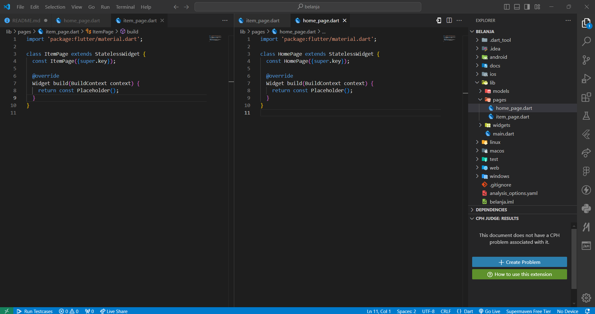

# Laporan Praktikum

<table>
  <tr>
    <th>Nama</th>
    <td>Raffy Jamil Octavialdy</td>
  </tr>
  <tr>
    <th>NIM</th>
    <td>2241720082</td>
  </tr>
  <tr>
    <th>Proyek</th>
    <td>Mobile Pertemuan 06</td>
  </tr>
</table>

## Praktikum 5 - Membangun Navigasi di Flutter

### Langkah 1 - Siapkan Project Baru


### Langkah 2 - Mendefinisikan Route



### Langkah 3 - Lengkapi Kode di `main.dart`

```dart
void main() {
  runApp(MaterialApp(
    initialRoute: '/',
    routes: {
      '/': (context) => const HomePage(),
      '/item': (context) => const ItemPage(),
    },
  ));
}
```

### Langkah 4 - Membuat Data Model

```dart
class Item {
  String name;
  int price;

  Item({
    required this.name,
    required this.price,
  });
}
```

### Langkah 5 - Lengkapi kode di class `HomePage`

```dart
final List<Item> items = [
    Item(name: 'Sugar', price: 5000),
    Item(name: 'Salt', price: 2000),
];
```

### Langkah 6 - Membuat ListView dan itemBuilder

```dart
return Scaffold(
  body: Container(
    margin: const EdgeInsets.all(8),
    child: ListView.builder(
      padding: const EdgeInsets.all(8),
      itemCount: items.length,
      itemBuilder: (context, index) {
        final item = items[index];
        return Card(
          child: Container(
            margin: const EdgeInsets.all(8),
            child: Row(
              children: [
                Expanded(child: Text(item.name)),
                Expanded(
                  child: Text(
                    item.price.toString(),
                    textAlign: TextAlign.end,
                  ),
                ),
              ],
            ),
          ),
        );
      },
    ),
  ),
);
```

### Langkah 7 - Menambahkan aksi pada ListView

```dart
return InkWell(
    onTap: () {
        Navigator.pushNamed(context, '/item');
    },
```

output:


## Tugas Praktikum 2

> 1. Untuk melakukan pengiriman data ke halaman berikutnya, cukup menambahkan informasi arguments pada penggunaan `Navigator`. Perbarui kode pada bagian `Navigator` menjadi seperti berikut.

```dart
Navigator.pushNamed(context, '/item', arguments: item);
```

> 2. Pembacaan nilai yang dikirimkan pada halaman sebelumnya dapat dilakukan menggunakan `ModalRoute`. Tambahkan kode berikut pada blok fungsi build dalam halaman `ItemPage`. Setelah nilai didapatkan, anda dapat menggunakannya seperti penggunaan variabel pada umumnya.

```dart
final itemArgs = ModalRoute.of(context)!.settings.arguments as Item;
```

> 3. Pada hasil akhir dari aplikasi belanja yang telah anda selesaikan, tambahkan atribut foto produk, stok, dan rating. Ubahlah tampilan menjadi GridView seperti di aplikasi marketplace pada umumnya.

```dart
class Item {
  String name;
  int price;
  String photo;
  int stock;
  double rating;

  Item({
    required this.name,
    required this.price,
    required this.photo,
    required this.stock,
    required this.rating,
  });
}
```

output:


> 4. Silakan implementasikan Hero widget pada aplikasi belanja Anda dengan mempelajari dari sumber ini: https://docs.flutter.dev/cookbook/navigation/hero-animations

```dart
Hero(
  tag: item.name,
  child: Image.network(
    item.photo,
    fit: BoxFit.cover,
  ),
),
```

> 5. Sesuaikan dan modifikasi tampilan sehingga menjadi aplikasi yang menarik. Selain itu, pecah widget menjadi kode yang lebih kecil. Tambahkan Nama dan NIM di footer aplikasi belanja Anda.

```dart
Container(
  padding: const EdgeInsets.all(8),
  child: const Text(
    'Nama: Raffy Jamil Octavialdy\nNIM: 2241720082\n',
    textAlign: TextAlign.center,
    style: TextStyle(
      fontSize: 16,
      fontWeight: FontWeight.bold,
    ),
  ),
),
```

output:


> 6. Selesaikan Praktikum 5: Navigasi dan Rute tersebut. Cobalah modifikasi menggunakan plugin go_router, lalu dokumentasikan dan push ke repository Anda berupa screenshot setiap hasil pekerjaan beserta penjelasannya di file README.md. Kumpulkan link commit repository GitHub Anda kepada dosen yang telah disepakati!

```dart
void main() {
  runApp(MaterialApp.router(
    routerConfig: router,
  ));
}

GoRouter router = GoRouter(
  routes: [
    GoRoute(
      path: '/',
      builder: (context, state) => HomePage(),
    ),
    GoRoute(
      path: '/item',
      builder: (context, state) => const ItemPage(),
    ),
  ],
);
```

home_page.dart

```dart
return InkWell(
    onTap: () {
        context.go('/item', extra: item);
    },
```

item_page.dart

```dart
final itemArgs = GoRouterState.of(context).extra as Item;
```

output:

