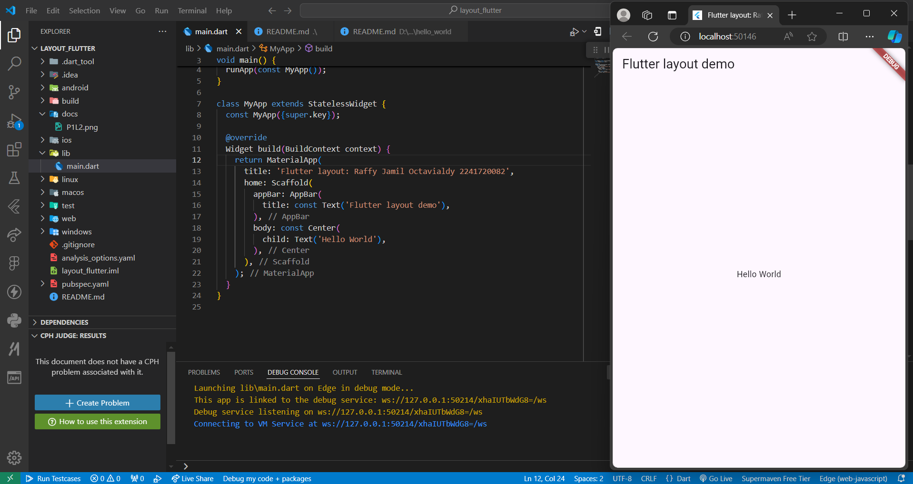
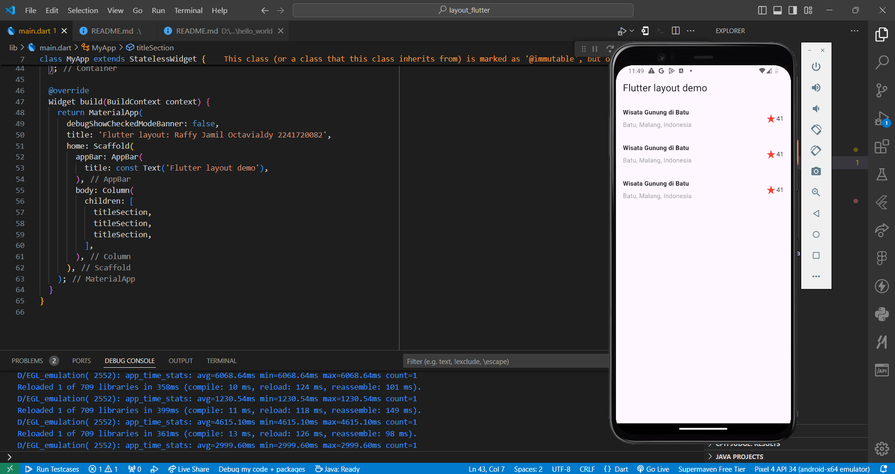
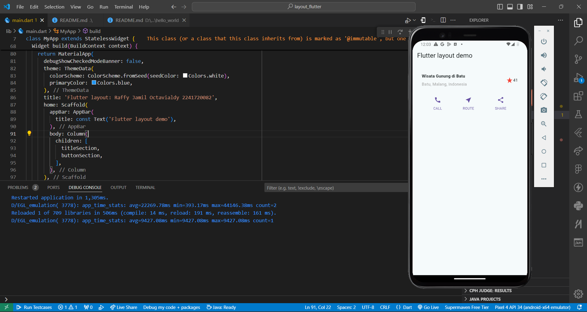
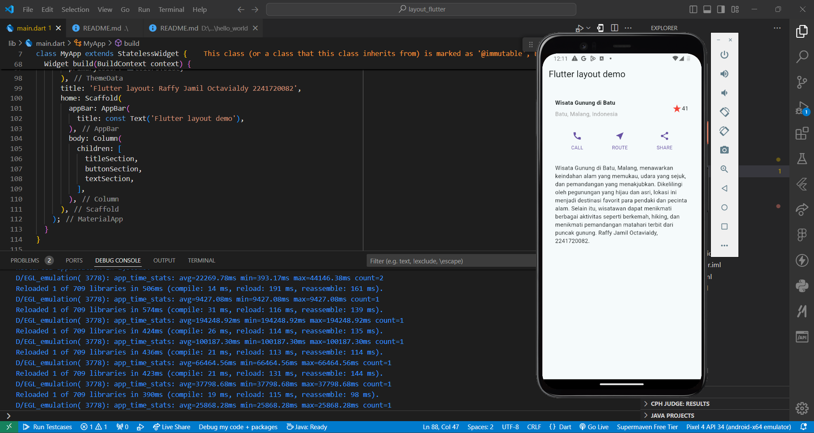
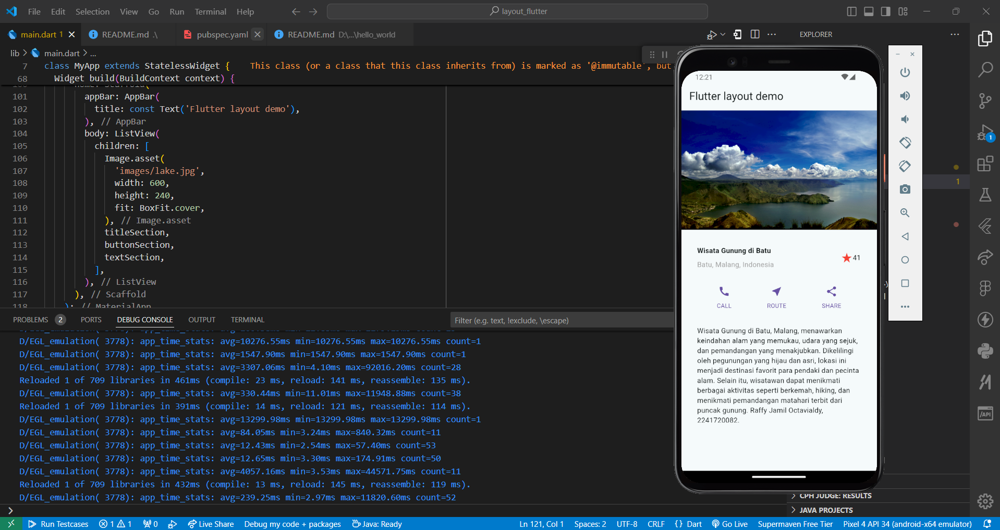

# Laporan Praktikum

<table>
  <tr>
    <th>Nama</th>
    <td>Raffy Jamil Octavialdy</td>
  </tr>
  <tr>
    <th>NIM</th>
    <td>2241720082</td>
  </tr>
  <tr>
    <th>Proyek</th>
    <td>Mobile Pertemuan 06</td>
  </tr>
</table>

## Praktikum 1 - Membangun Layout di Flutter

### Langkah 1 - Buat Project Baru
> Buatlah sebuah project flutter baru dengan nama layout_flutter. Atau sesuaikan style laporan praktikum yang Anda buat.

Done.

### Langkah 2 - Buka file lib/main.dart
> Buka file `main.dart` lalu ganti dengan kode berikut. Isi nama dan NIM Anda di `text title`.

```dart
import 'package:flutter/material.dart';

void main() => runApp(const MyApp());

class MyApp extends StatelessWidget {
  const MyApp({super.key});

  @override
  Widget build(BuildContext context) {
    return MaterialApp(
      title: 'Flutter layout: Nama dan NIM Anda',
      home: Scaffold(
        appBar: AppBar(
          title: const Text('Flutter layout demo'),
        ),
        body: const Center(
          child: Text('Hello World'),
        ),
      ),
    );
  }
}
```
output:



### Langkah 3 - Identifikasi layout diagram
Done.

### Langkah 4 - Implementasi title row

```dart
Widget titleSection = Container(
  padding: const EdgeInsets.all(...),
  child: Row(
    children: [
      Expanded(
        /* soal 1*/
        child: Column(
          crossAxisAlignment: ...,
          children: [
            /* soal 2*/
            Container(
              padding: const EdgeInsets.only(bottom: ...),
              child: const Text(
                'Wisata Gunung di Batu',
                style: TextStyle(
                  fontWeight: FontWeight.bold,
                ),
              ),
            ),
            Text(
              'Batu, Malang, Indonesia',
              style: TextStyle(...),
            ),
          ],
        ),
      ),
      /* soal 3*/
      Icon(
       ...,
        color: ...,
      ),
      const Text(...),
    ],
  ),
);
```

> /* soal 1 */ Letakkan widget Column di dalam widget Expanded agar menyesuaikan ruang yang tersisa di dalam widget Row. Tambahkan properti crossAxisAlignment ke CrossAxisAlignment.start sehingga posisi kolom berada di awal baris.

> /* soal 2 */ Letakkan baris pertama teks di dalam Container sehingga memungkinkan Anda untuk menambahkan padding = 8. Teks ‘Batu, Malang, Indonesia' di dalam Column, set warna menjadi abu-abu.
```dart
Expanded(
  /* soal 1*/
  child: Column(
    crossAxisAlignment: CrossAxisAlignment.start,
    children: [
      /* soal 2*/
      Container(
        padding: const EdgeInsets.only(bottom: 8),
        child: const Text(
          'Wisata Gunung di Batu',
          style: TextStyle(
            fontWeight: FontWeight.bold,
          ),
        ),
      ),
      const Text(
        'Batu, Malang, Indonesia',
        style: TextStyle(color: Colors.grey),
      ),
    ],
  ),
),
```

> /* soal 3 */ Dua item terakhir di baris judul adalah ikon bintang, set dengan warna merah, dan teks "41". Seluruh baris ada di dalam Container dan beri padding di sepanjang setiap tepinya sebesar 32 piksel. Kemudian ganti isi body text ‘Hello World' dengan variabel titleSection seperti berikut:
```dart
/* soal 3*/
const Icon(
  Icons.star_rate,
  color: Colors.red,
),
const Text('41'),
```

output:



## Praktikum 2 - Implementasi Button Row

### Langkah 1 - Buat method Column _buildButtonColumn

```dart
Column _buildButtonColumn(Color color, IconData icon, String label) {
  return Column(
    mainAxisSize: MainAxisSize.min,
    mainAxisAlignment: MainAxisAlignment.center,
    children: [
      Icon(icon, color: color),
      Container(
        margin: const EdgeInsets.only(top: 8),
        child: Text(
          label,
          style: TextStyle(
            fontSize: 12,
            fontWeight: FontWeight.w400,
            color: color,
          ),
        ),
      ),
    ],
  );
}
```

### Langkah 2 - Buat widget buttonSection

```dart
Color color = Theme.of(context).primaryColor;

Widget buttonSection = Row(
  mainAxisAlignment: MainAxisAlignment.spaceEvenly,
  children: [
    _buildButtonColumn(color, Icons.call, 'CALL'),
    _buildButtonColumn(color, Icons.near_me, 'ROUTE'),
    _buildButtonColumn(color, Icons.share, 'SHARE'),
  ],
);
```

### Langkah 3 - Tambah button section ke body
```dart
body: Column(
  children: [
    titleSection,
    buttonSection,
  ],
),
```

output:



## Praktikum 3 - Implementasi Text Section

### Langkah 1 - Buat widget textSection

```dart
Widget textSection = Container(
  padding: const EdgeInsets.all(32),
  child: const Text(
    'Carilah teks di internet yang sesuai '
    'dengan foto atau tempat wisata yang ingin '
    'Anda tampilkan. '
    'Tambahkan nama dan NIM Anda sebagai '
    'identitas hasil pekerjaan Anda. '
    'Selamat mengerjakan 🙂.',
    softWrap: true,
  ),
);
```

### Langkah 2 - Tambahkan variabel text section ke body

```dart
body: Column(
  children: [
    titleSection,
    buttonSection,
    textSection,
  ],
),
```

output:



## Praktikum 4 - Implementasi image section

### Langkah 1 - Siapkan aset gambar

```yaml
assets:
  - images/lake.jpg
```

### Langkah 2 - Tambahkan gambar ke body

```dart
body: Column(
  children: [
    Image.asset(
      'images/lake.jpg',
      width: 600,
      height: 240,
      fit: BoxFit.cover,
    ),
    titleSection,
    buttonSection,
    textSection
  ],
),
```

### Langkah 3 - Terakhir, ubah menjadi ListView

```dart
body: ListView(
  children: [
    Image.asset(
      'images/lake.jpg',
      width: 600,
      height: 240,
      fit: BoxFit.cover,
    ),
    titleSection,
    buttonSection,
    textSection
  ],
),
```

output:



## Tugas Praktikum 1

> 1. Selesaikan Praktikum 1 sampai 4, lalu dokumentasikan dan push ke repository Anda berupa screenshot setiap hasil pekerjaan beserta penjelasannya di file README.md!

> 2. Silakan implementasikan di project baru "basic_layout_flutter" dengan mengakses sumber ini: https://docs.flutter.dev/codelabs/layout-basics

> 3. Kumpulkan link commit repository GitHub Anda kepada dosen yang telah disepakati!

Done.