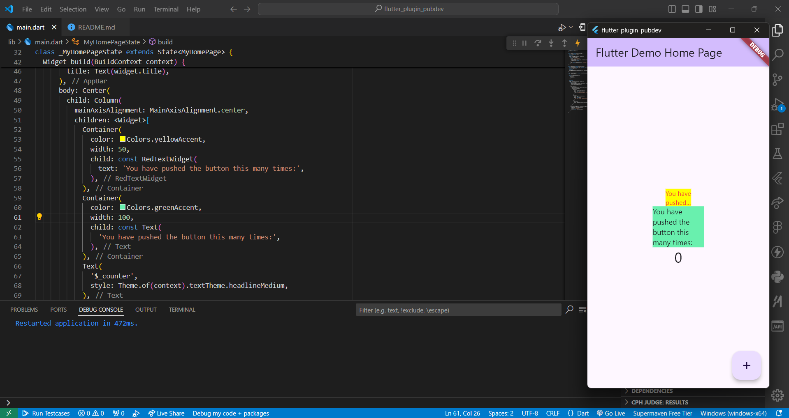

# Laporan Praktikum

<table>
  <tr>
    <th>Nama</th>
    <td>Raffy Jamil Octavialdy</td>
  </tr>
  <tr>
    <th>NIM</th>
    <td>2241720082</td>
  </tr>
  <tr>
    <th>Proyek</th>
    <td>Mobile Pertemuan 07</td>
  </tr>
</table>

# Tugas

1. Selesaikan Praktikum tersebut, lalu dokumentasikan dan push ke repository Anda berupa screenshot hasil pekerjaan beserta penjelasannya di file README.md!
2. Jelaskan maksud dari langkah 2 pada praktikum tersebut!
3. Jelaskan maksud dari langkah 5 pada praktikum tersebut!
4. Pada langkah 6 terdapat dua widget yang ditambahkan, jelaskan fungsi dan perbedaannya!
5. Jelaskan maksud dari tiap parameter yang ada di dalam plugin `auto_size_text` berdasarkan tautan pada dokumentasi ini!

## 1. Selesaikan Praktikum

### Langkah 1: Buat Project Baru
Done.

### Langkah 2: Menambahkan Plugin
```sh
flutter pub add auto_size_text
```

### Langkah 3: Buat file `red_text_widget.dart`
```dart
import 'package:flutter/material.dart';

class RedTextWidget extends StatelessWidget {
  const RedTextWidget({Key? key}) : super(key: key);

  @override
  Widget build(BuildContext context) {
    return Container();
  }
}
```

### Langkah 4: Tambah Widget AutoSizeText
```dart
return AutoSizeText(
    text,
    style: const TextStyle(color: Colors.red, fontSize: 14),
    maxLines: 2,
    overflow: TextOverflow.ellipsis,
);
```

### Langkah 5: Buat Variabel text dan parameter di constructor
```dart
final String text;

const RedTextWidget({Key? key, required this.text}) : super(key: key);
```

### Langkah 6: Tambahkan widget di `main.dart`
```dart
Container(
    color: Colors.yellowAccent,
    width: 50,
    child: const RedTextWidget(
        text: 'You have pushed the button this many times:',
    ),
),
Container(
    color: Colors.greenAccent,
    width: 100,
    child: const Text(
        'You have pushed the button this many times:',
    ),
),
```

> Run aplikasi tersebut dengan tekan F5, maka hasilnya akan seperti berikut.



## 2. Jelaskan maksud dari langkah 2 pada praktikum tersebut!

> Tambahkan plugin auto_size_text menggunakan perintah berikut di terminal

> flutter pub add auto_size_text
Jika berhasil, maka akan tampil nama plugin beserta versinya di file pubspec.yaml pada bagian dependencies.

Fungsi dari langkah tersebut adalah untuk menambahkan plugin `auto_size_text` pada project flutter kita. Perintah tersebut akan menambahkan package `auto_size_text` pada file `pubspec.yaml` dan secara otomatis akan menjalankan flutter pub get untuk mengunduh package tersebut.

## 3. Jelaskan maksud dari langkah 5 pada praktikum tersebut!

> Tambahkan variabel text dan parameter di constructor seperti berikut.

```dart
final String text;

const RedTextWidget({Key? key, required this.text}) : super(key: key);
```

Langkat tersebut bertujuan untuk menambahkan variabel text dan parameter di constructor. Variabel text digunakan untuk menampung teks yang akan ditampilkan, sedangkan parameter di constructor digunakan untuk menginisialisasi variabel text.

## 4. Pada langkah 6 terdapat dua widget yang ditambahkan, jelaskan fungsi dan perbedaannya!

> Buka file `main.dart` lalu tambahkan di dalam children: pada class `_MyHomePageState`

```dart
Container(
    color: Colors.yellowAccent,
    width: 50,
    child: const RedTextWidget(
        text: 'You have pushed the button this many times:',
    ),
),
Container(
    color: Colors.greenAccent,
    width: 100,
    child: const Text(
        'You have pushed the button this many times:',
    ),
),
```

> Run aplikasi tersebut dengan tekan F5, maka hasilnya akan seperti berikut.

Fungsi dari kedua widget tersebut adalah untuk menampilkan teks yang sama. Perbedaannya adalah pada widget `RedTextWidget`, teks yang ditampilkan akan menyesuaikan ukuran lebar widget. Sedangkan pada widget `Text`, teks yang ditampilkan tidak akan menyesuaikan ukuran lebar widget. Sehingga jika ukuran lebar widget lebih kecil dari ukuran teks, maka teks akan terpotong.

## 5. Jelaskan maksud dari tiap parameter yang ada di dalam plugin `auto_size_text` berdasarkan tautan pada dokumentasi ini!

> https://pub.dev/packages/auto_size_text

| Parameter           | Keterangan                                                                                                                                |
| ------------------- | ----------------------------------------------------------------------------------------------------------------------------------------- |
| key                 | Mengendalikan bagaimana satu widget menggantikan widget lain dalam pohon.                                                                 |
| textKey             | Mengatur kunci untuk widget Teks yang dihasilkan                                                                                          |
| style               | Jika tidak null, gaya yang digunakan untuk teks ini                                                                                       |
| minFontSize         | Batasan ukuran teks minimum yang digunakan saat teks disesuaikan secara otomatis. Akan diabaikan jika presetFontSizes diatur.             |
| maxFontSize         | Batasan ukuran teks maksimum yang digunakan saat teks disesuaikan secara otomatis. Akan diabaikan jika presetFontSizes diatur.            |
| stepGranularity     | Ukuran langkah di mana ukuran font disesuaikan dengan batasan.                                                                            |
| presetFontSizes     | Mendefinisikan semua ukuran font yang mungkin. Penting: presetFontSizes harus dalam urutan menurun.                                       |
| group               | Menyinkronkan ukuran beberapa AutoSizeTexts                                                                                               |
| textAlign           | Cara teks harus diatur secara horizontal.                                                                                                 |
| textDirection       | Keberarahannya teks. Ini menentukan bagaimana nilai textAlign seperti TextAlign.start dan TextAlign.end diinterpretasikan.                |
| locale              | Digunakan untuk memilih jenis huruf ketika karakter Unicode yang sama dapat dirender dengan cara yang berbeda, tergantung pada lokasinya. |
| softWrap            | Apakah teks harus patah pada pemisahan baris lembut.                                                                                      |
| wrapWords           | Apakah kata-kata yang tidak muat dalam satu baris harus dibungkus. Defaultnya true untuk berperilaku seperti Teks.                        |
| overflow            | Bagaimana overflow visual harus diatasi.                                                                                                  |
| overflowReplacement | Jika teks meluap dan tidak muat dalam batasnya, widget ini ditampilkan sebagai gantinya.                                                  |
| textScaleFactor     | Jumlah piksel huruf untuk setiap piksel logis. Juga memengaruhi minFontSize, maxFontSize, dan presetFontSizes.                            |
| maxLines            | Jumlah maksimum baris opsional untuk teks.                                                                                                |
| semanticsLabel      | Label semantik alternatif untuk teks ini.               